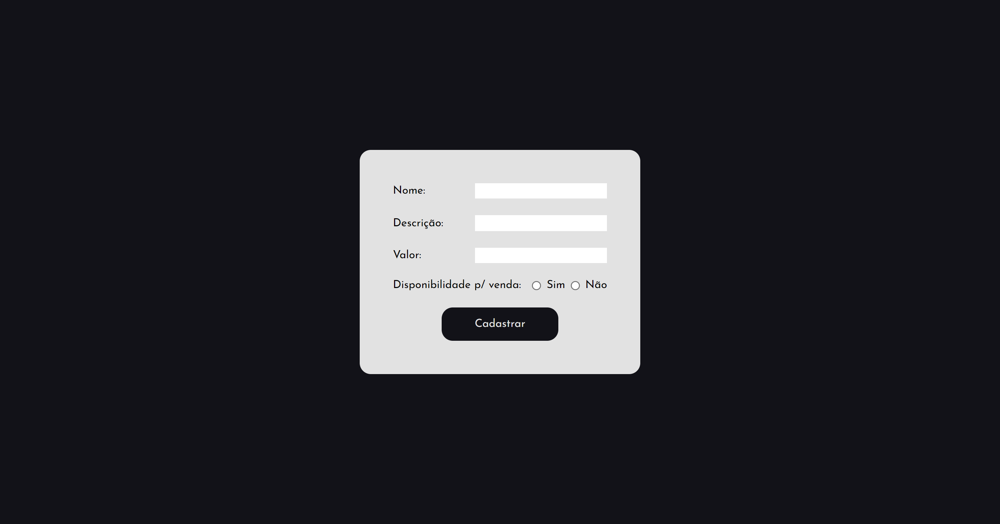
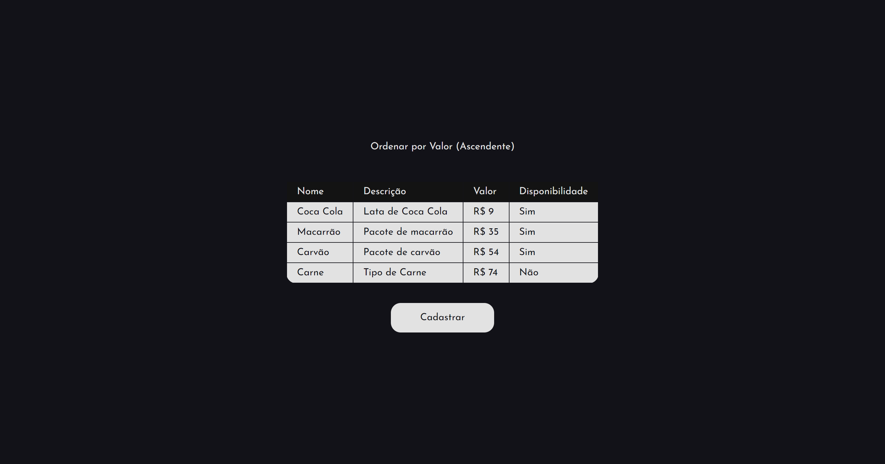
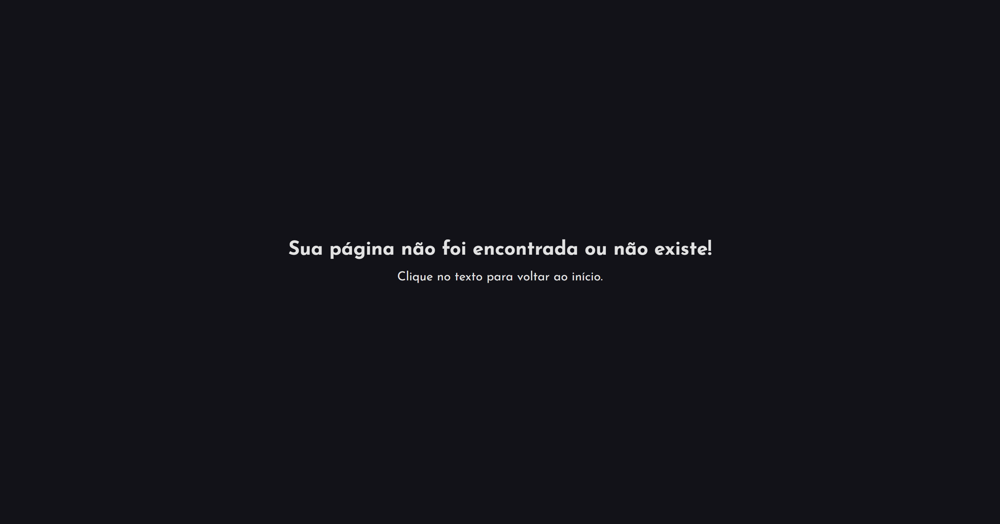

# Oak Tecnologia


<p align="center">
    
</p>

<p align="center">
    <a href="#about">Sobre |</a> 
    <a href="#started">Primeiros passos</a> 
    <a href="#routes">| Routas da Aplicação</a> 
</p>

<h2 id="about">📌 Sobre</h2>

Este projeto é uma aplicação web desenvolvida com React que permite aos usuários registrar e visualizar uma lista de itens com suas respectivas descrições, valores e disponibilidade.

<h2 id="started">🚀 Primeiros passos</h2>

Para inicializar o projeto é necessário seguir os comandos a seguir:

<h3>Clonando</h3>

```bash
git clone https://github.com/RafaelHDSV/Oak-Tecnologia.git
npm install
npm install react-router-dom
```

<h3>Começando</h3>

```bash
cd Oak-Tecnologia
npm start
```

<h2 id="routes">📍 Routas da Aplicação</h2>

O projeto é basicamente dividido em duas rotas:
​
| route | description  
|----------------------|-----------------------------------------------------
| <kbd>/</kbd> | página principal, onde se insere novos itens
| <kbd>/list</kbd> | página onde mostra todos os itens da lista em forma de tabela
| <kbd>erro</kbd> | página quando uma rota não existe ou não é encontrada

<hr/>

### route: <kbd>/</kbd>


<hr/>

### route: <kbd>/list</kbd>



<hr/>

### route: <kbd>erro</kbd



<hr/>

## Requisitos para a vaga

Requisito: 𝐂𝐚𝐝𝐚𝐬𝐭𝐫𝐨 𝐞 𝐥𝐢𝐬𝐭𝐚𝐠𝐞𝐦 𝐝𝐞 𝐩𝐫𝐨𝐝𝐮𝐭𝐨𝐬

𝐂𝐚𝐝𝐚𝐬𝐭𝐫𝐨:

-    Formulário com os campos abaixo:

     -    Nome do produto - campo de texto
     -    Descrição do produto - campo de texto
     -    Valor do produto - campo de valor
     -    Disponível para venda - campo com 2 opções: sim / não

𝐋𝐢𝐬𝐭𝐚𝐠𝐞𝐦:

-    Colunas da listagem: nome, valor
-    Ordenação por valor do menor para o maior
-    Quando cadastrar um novo produto é para abrir a listagem automaticamente
-    Deve existir um botão para cadastrar um novo produto a partir da listagem

𝐏𝐨𝐝𝐞 𝐢𝐦𝐩𝐥𝐞𝐦𝐞𝐧𝐭𝐚𝐫 𝐚 𝐩𝐫𝐨𝐯𝐚 𝐚𝐭𝐞́ 𝐨𝐧𝐝𝐞 𝐜𝐨𝐧𝐬𝐞𝐠𝐮𝐢𝐫.
𝐀 𝐢𝐦𝐩𝐥𝐞𝐦𝐞𝐧𝐭𝐚𝐜̧𝐚̃𝐨 𝐩𝐨𝐝𝐞 𝐬𝐞𝐫 𝐫𝐞𝐚𝐥𝐢𝐳𝐚𝐝𝐚 𝐜𝐨𝐦 𝐪𝐮𝐚𝐥𝐪𝐮𝐞𝐫 𝐥𝐢𝐧𝐠𝐮𝐚𝐠𝐞𝐦 𝐝𝐞 𝐩𝐫𝐨𝐠𝐫𝐚𝐦𝐚𝐜̧𝐚̃𝐨.
